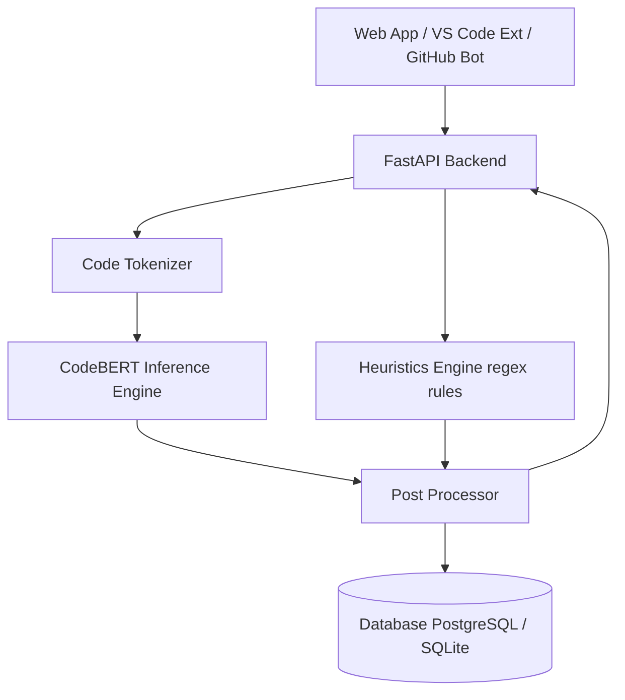

# 🤖 AI-Powered Code Bug Predictor

An intelligent system that detects bug-prone code patterns before execution, using a hybrid approach combining a fine-tuned CodeBERT model and rule-based heuristics.

## 🏗️ Architecture



## 🛠️ Tech Stack

- **Backend:** Python, FastAPI, PyTorch, Transformers (Hugging Face)
- **Frontend:** React, Vite, Tailwind CSS (or standard CSS)
- **Model:** Pre-trained `microsoft/codebert-base` (fine-tuned)
- **Containerization:** Docker (Optional)

## 🚀 How to Run

### Option 1: Using Docker (Recommended)

*Coming soon! We are actively working on containerizing the application.*

### Option 2: Running Locally

**1. Backend (FastAPI)**

```bash
cd backend
python -m venv venv
# Windows: venv\Scripts\activate | Mac/Linux: source venv/bin/activate
pip install -r requirements.txt
uvicorn app.main:app --reload
```

API Documentation available at: `http://127.0.0.1:8000/docs`

**2. Frontend (React + Vite)**

```bash
cd frontend
npm install
npm run dev
```

UI available at: `http://localhost:5173`

## 🔌 API Endpoints

- `GET /api/v1/health`: Check API health status.
- `POST /api/v1/predict`: Submit code snippet for bug prediction.
  - **Body:** `{"code": "...", "language": "python"}`
- `GET /api/v1/dashboard/stats`: Retrieve historical scan statistics.

---
*Built to reduce debugging time and catch subtle bugs before production.*
